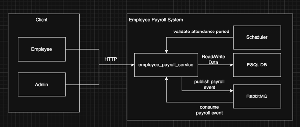
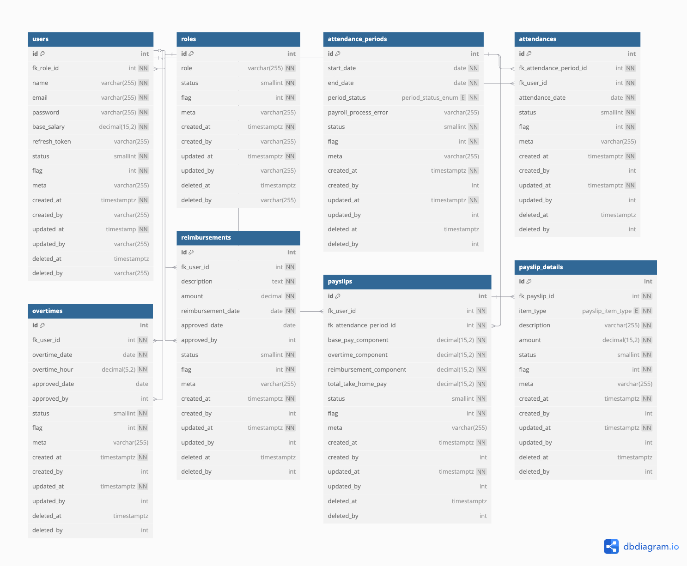

# Attendance and Payroll System

This project is a Go-based backend service for managing employee attendance periods and payroll processing.

## Features

### Attendance Management
- **Admin Attendance Period Management**: Admins can add attendance period start and end dates for a specific payroll.
- **Employee Attendance Submission**: Employees can submit their attendance for a specific day.
    - No rules for late or early check-ins or check-outs; any check-in during the day counts.
    - Multiple submissions on the same day are counted as one.
    - Attendance submissions are not allowed on weekends.

### Overtime Management
- **Employee Overtime Submission**: Employees can submit overtime after completing their work.
    - Employees can specify the number of hours for overtime.
    - Overtime cannot exceed 3 hours per day.
    - Overtime can be submitted for any day.

### Reimbursement Management
- **Employee Reimbursement Submission**: Employees can submit reimbursement requests.
    - Employees can attach the amount to be reimbursed.
    - Employees can provide a description for the reimbursement.

### Payroll Processing
- **Run Payroll**: Admins can process payroll for a specific attendance period.
    - Once payroll is processed, attendance, overtime, and reimbursement records for that period are locked and cannot affect the payslip.
    - Payroll can only be processed once per attendance period.

### Payslip Generation
- **Employee Payslip Generation**: Employees can generate their payslip for a specific attendance period.
    - Payslip includes a breakdown of attendance and its effect on salary.
    - Payslip includes a breakdown of overtime and its multiplier effect on salary.
    - Payslip includes a list of reimbursements.
    - Payslip includes the total take-home pay, which is the sum of all components.

### Payroll Summary
- **Admin Payroll Summary Generation**: Admins can generate a summary of all employee payslips for a specific attendance period.
    - Summary includes the take-home pay of each employee.
    - Summary includes the total take-home pay of all employees.

### Scheduler

The system includes an automated scheduler to manage attendance periods efficiently. It performs the following tasks:

1. **Closing Attendance Periods**:
  - Automatically identifies attendance periods with a status of `Open` that have passed their `EndDate`.
  - Updates these periods to a status of `Closed`.

2. **Opening Upcoming Periods**:
  - If no attendance periods are currently `Open`, the scheduler checks for `Upcoming` periods where the `StartDate` is less than or equal to the current date.
  - Updates these periods to a status of `Open`.

The scheduler is implemented in the `ValidateAttendancePeriodScheduler` method, which uses domain methods to update and retrieve attendance periods. This ensures that attendance periods transition between statuses automatically without manual intervention.

## Architecture

### Business Logic Layer

The system follows a clean architecture approach with the following components:

- **Usecase**: Contains business logic implementation
- **Domain**: Handles entity operations and data persistence
- **DTO**: Data Transfer Objects for API communication
- **Entity**: Core domain models

### Software Architecture
The architecture is designed as a single, robust Go service that handles all business logic while leveraging modern patterns for reliability and automation. The diagram below illustrates the key components and the flow of data within the system.



#### Component Breakdown

* ##### Client
  This represents the external users who interact with the system via HTTP requests to the REST API.
  * **Admin:** A privileged user responsible for system management, such as defining payroll periods and running the payroll process.
  * **Employee:** A regular user who can submit their attendance and claims, and view their generated payslips.

* ##### Employee Payroll System
  This is the self-contained backend system that encapsulates all the core logic and infrastructure.

  * **`employee_payroll_service` (The Core Application):** This is the heart of the system, a single Go application that serves multiple roles concurrently:
    1.  **REST API Server:** It exposes all HTTP endpoints and handles synchronous requests from clients.
    2.  **Job Producer/Consumer:** For long-running tasks like calculating payroll, the service publishes a job to RabbitMQ and immediately responds to the admin. Concurrently, it consumes jobs from the queue to execute the heavy processing in the background.
    3.  **Scheduler:** It uses an in-application library (`gocron`) to run internal, time-based tasks automatically, such as updating the status of payroll periods daily. This is represented by the "validate attendance period" flow.

  * **`PSQL DB` (PostgreSQL Database):** The database provides stateful persistence and acts as the single source of truth for all application data, including users, attendance records, and final payslips.

  * **`RabbitMQ` (Message Queue):** This message broker is used to decouple the payroll trigger from the actual calculation. This makes the API highly responsive and ensures that the payroll processing job is handled reliably in the background.

### Database Design



## API Usage

The API requires authorization for most endpoints. Users must include a valid Bearer token in the `Authorization` header of their HTTP requests. Tokens are issued upon successful login and are tied to user roles (Admin or Employee), which determine access to specific endpoints.

For detailed API documentation, including available endpoints, request/response examples, and error handling, please refer to the Swagger documentation. You can access it by running the application and navigating to `/swagger/index.html` in your browser.


## Development Setup

### Prerequisites

- Go 1.21+
- Docker (for running RabbitMQ, PostgreSQL, and Redis)

### Set Up Project

Before running the application, you need to set up the project environment. Follow these steps:

copy the default configuration file:

```bash
cp ./etc/cfg/conf.json.example ./etc/cfg/conf.json
````
you can edit the `conf.json` file to set your environment variables, such as database connection strings, RabbitMQ settings, and other configurations. But i recommend you to follow the default settings, which should work out of the box.

Run the docker-compose to start the necessary services (RabbitMQ, PostgreSQL, and Redis):

```bash
cd env
docker-compose up -d
````

After the services are up, you need to initialize the database schema and seed data. Run the following command:

```bash
cd docs/sql
./init.sh
```

Finally, you can run the application.

### Running the Application

For run the application, you need to install the Swagger tool and generate the API documentation. Run the following commands:

```bash
make swag-install
```

Make sure the installation is correct by running:

```bash
make swaggo
```

After that, you can start the application by running:

```bash
make run
```
This will start the application, and you can access the Swagger documentation at
- `http://localhost:8080/swagger/index.html`

## Default Credentials

After setting up the project, you can use the following default credentials to log in:

- **Admin Account**:
  - Username: `admin@payroll.com`
  - Password: `password`

- **Employee Account**:
  - Username: `user11@payroll.com`
  - Password: `password`

These credentials are for testing purposes only. Please ensure to update them in a production environment.

## Testing

```bash
# Run all tests
make run-tests
```